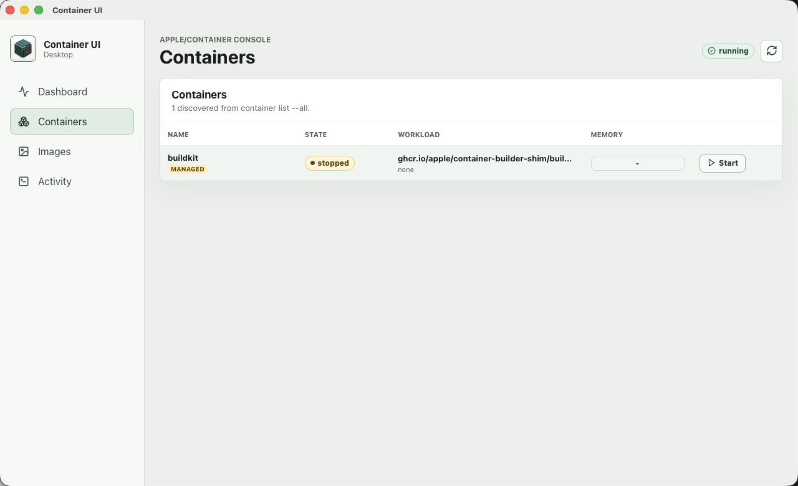

# Container UI

Lightweight macOS desktop console that makes local [`apple/container`](https://github.com/apple/container) containers easier to inspect and operate through a focused UI.

## Features

- Shows local containers, images, volumes, networks, system status, and one-shot stats.
- Presents container state, workload, memory, details, and recent logs in a readable UI.
- Starts containers and can start the local `container system` when it is unavailable.
- Requires an explicit approval phrase and reason before stopping a container.
- Records local command activity under the app data directory.

## Screenshot



## Requirements

- macOS with Apple silicon.
- `apple/container` installed at `/usr/local/bin/container`, `/opt/homebrew/bin/container`, or `/usr/bin/container`.
- Node.js 24.18.0.
- Rust/Cargo.

## Distribution

Signed and notarized macOS builds are distributed through GitHub Releases:

- [Container UI 0.1.0](https://github.com/yoshhiide/container-ui/releases/tag/0.1.0)

Download `Container.UI_0.1.0_aarch64.dmg` from the release page. To verify it:

```bash
shasum -a 256 Container.UI_0.1.0_aarch64.dmg
xcrun stapler validate Container.UI_0.1.0_aarch64.dmg
spctl --assess --type open --context context:primary-signature --verbose=4 Container.UI_0.1.0_aarch64.dmg
```

Expected SHA-256:

```text
032383504fd44e2d57d7c6cdfc5e0d4077ab8ea8d1fac8f678d4d7765e6f7961
```

The release DMG has been accepted by Gatekeeper with `source=Notarized Developer ID`.

## Development

```bash
npm install
npm run tauri:dev
```

Common checks:

```bash
mise run local-check
```

Browser-only preview:

```bash
npm run dev -- --host 127.0.0.1
```

## Packaging

```bash
mise run local-package
```

Build artifacts are generated under:

- `src-tauri/target/release/bundle/macos/Container UI.app`
- `src-tauri/target/release/bundle/dmg/Container UI_0.1.0_aarch64.dmg`

## Security Model

The desktop backend executes fixed `container` command patterns only. The frontend cannot submit arbitrary shell commands or arbitrary CLI arguments.

Key guardrails:

- Container IDs are validated before use.
- Stop requires a fresh approval challenge, `STOP <container-id>`, and a reason.
- Managed apple/container resources such as `buildkit` cannot be stopped from Container UI.
- Logs, inspect output, command errors, and activity records mask likely secrets.

Activity records are stored at:

```text
~/Library/Application Support/app.yoshhiide.container-ui/activity.jsonl
```

## License

Licensed under the Apache License, Version 2.0. See [LICENSE](LICENSE).
